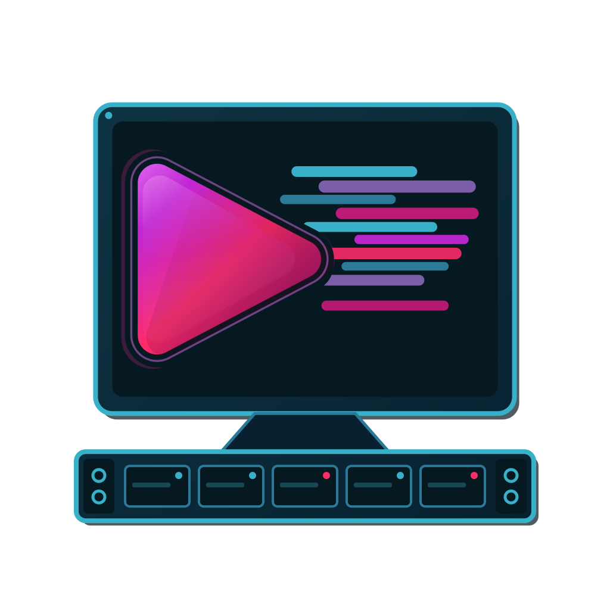
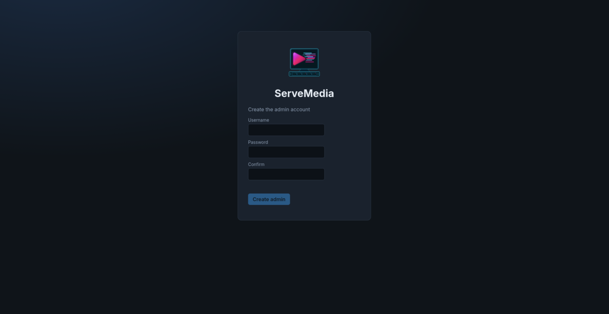
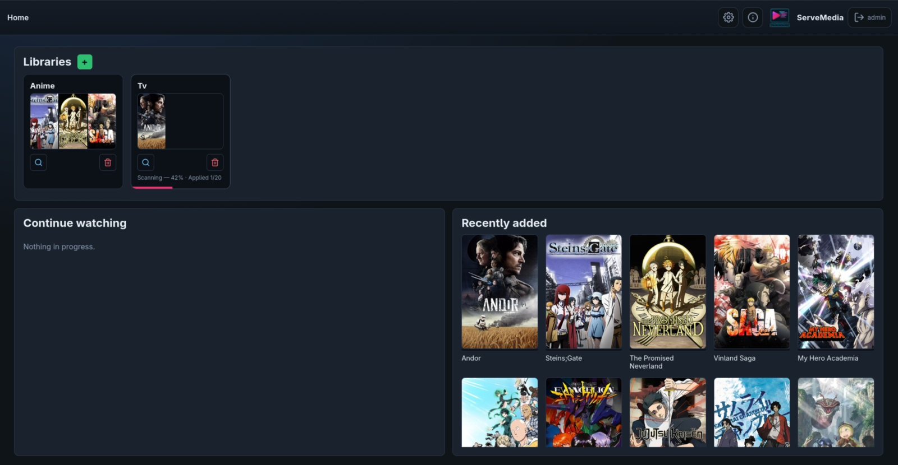
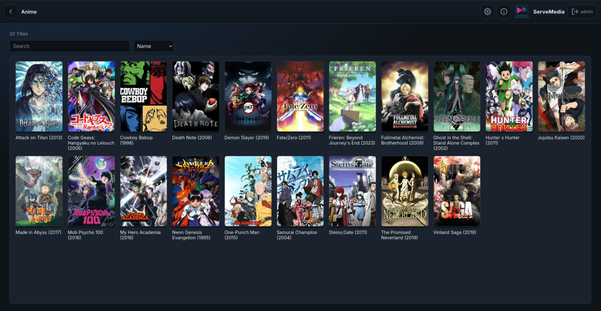
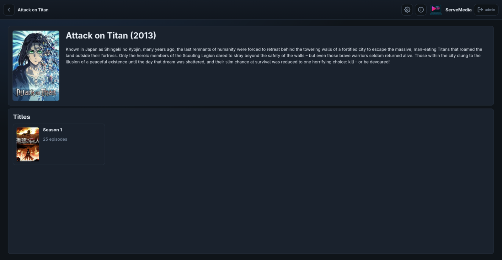
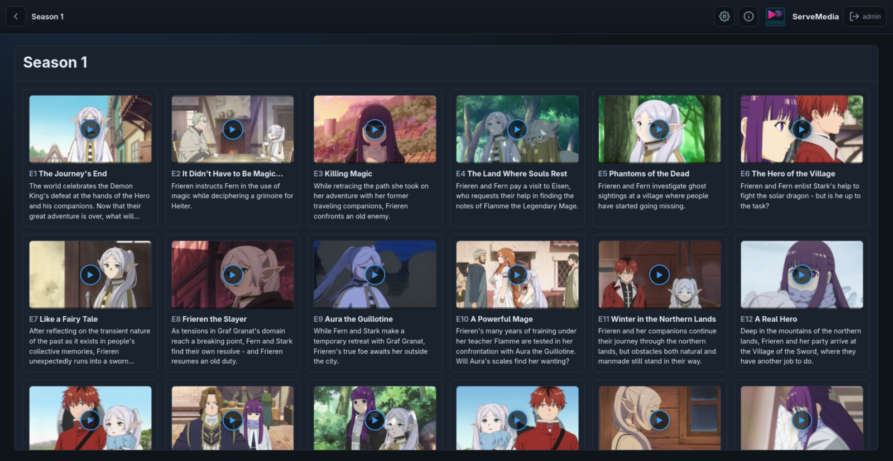
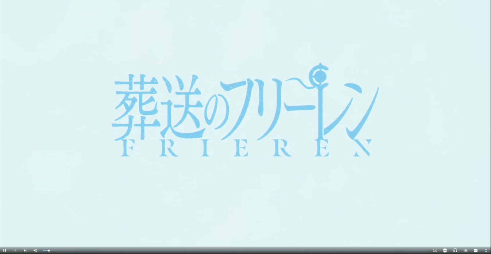
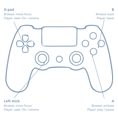
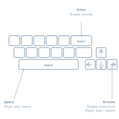

<p align="center">
  
</p>

<h1 align="center">ServeMedia</h1>

<p align="justified">
<b>ServeMedia</b> is <it>The Self-Hosted Media-Server for Linux</it>. It is built around a core application called MatchMedia which acts as a statistical engine responsible for directory hierarchy discovery of media libraries, title extraction and grouping, metadata search-and-fetch from providers like TVMaze, statistically scoring and ranking candidates and mapping them to the appropriate files. <b>ServeMedia</b> is built to be lightweight, minimal and concise, yet feature-complete for a self hosted media server. <b>ServeMedia</b> provides a desktop entry which starts its services then opens the browser pointed to its webpage (port <b>7676</b>), which is server-side-rendered and provides a home theater experience, complete with dri accelerated hls streamed video playback.
</p>

> [!WARNING]
> ServeMedia is currently in Beta, users might face some breaking bugs or incomplete functionality.
> Work is being done to remedy any issues, please feel free to open up [issues on github](https://github.com/AlyShmahell/ServeMedia/issues )

## Requirements

- Linux x86_64
- GPU transcode: 
  1. host Mesa/`libva` when present for Harware Acceleration (on GPU/iGPU)
  2. otherwise software encode (on CPU)

## Install

### As a Desktop Application

| AppImage (Download) | Flatpak (Download) | AppImage (Install with AppManager) | Flatpak (Install with Gnome Software) |
| --- | --- | --- | --- |
| [](https://github.com/AlyShmahell/ServeMedia/releases/latest/download/servemedia-linux-amd64.AppImage) | [](https://github.com/AlyShmahell/ServeMedia/releases/latest/download/servemedia-linux-amd64.flatpak) | [](appimg://install?url=https%3A%2F%2Fgithub.com%2FAlyShmahell%2FServeMedia%2Freleases%2Flatest%2Fdownload%2Fservemedia-linux-amd64.AppImage) | [](flatpak+https://github.com/AlyShmahell/ServeMedia/releases/latest/download/servemedia-linux-amd64.flatpak) |

#### Flatpak

Needs `org.freedesktop.Platform.ffmpeg-full` (26.08).

```bash
flatpak run eu.alyshmahell.ServeMedia
```

- Sandbox can already read `/media`, `/mnt`, `/run/media`, `~/Videos`, and `~/Music`. 
- Extra media library directories:
  ```bash
  flatpak override --user --filesystem=/path/to/library eu.alyshmahell.ServeMedia
  ```

### As a Server Application

```bash
curl -fL https://github.com/AlyShmahell/ServeMedia/releases/latest/download/servemedia-linux-amd64.tar.gz \
  | tar -xz -C "$HOME" --strip-components=1 servemedia/.local
```

## Start

- Desktop entry, `flatpak run eu.alyshmahell.ServeMedia`, or `servemedia`
- Browser opens on port **7676** (`SERVEMEDIA_NO_BROWSER=1` skips that)
- A second start opens the app and exits if ServeMedia is already listening
- First visit is `/register` and creates the **admin**; after that `/register` is gone
- Other users: Settings → Users

## How to

Start ServeMedia, create the admin, add a library, open a title, and play.

Create the admin account.

<p align="center">
  
</p>

Home with libraries and recently added titles.

<p align="center">
  
</p>

Anime library poster grid.

<p align="center">
  
</p>

Title page with plot and seasons.

<p align="center">
  
</p>

Season page with episode stills.

<p align="center">
  
</p>

Browser playback.

<p align="center">
  
</p>

## Controls

Arrow keys or a gamepad move focus on Home, libraries, titles, and Settings. The focus outline appears while using arrows or a pad, not for mouse-only use.

<p align="center">
  
</p>
<p align="center">
  
</p>

If the pad does nothing in **Firefox from Flathub**, grant host udev, then fully quit Firefox and reopen ServeMedia:

```bash
flatpak override --user --filesystem=/run/udev:ro org.mozilla.firefox
```

Same grant works in Flatseal. Other Flatpak browsers: use that app’s ID. Distro Firefox usually needs nothing extra.

## Media

Default media library roots: `/mnt`, `/media`, `$XDG_VIDEOS_DIR`, `$XDG_MUSIC_DIR`.

| | Flatpak | AppImage |
|--|---------|----------|
| Data | `~/.var/app/eu.alyshmahell.ServeMedia/data/servemedia/` | `~/.local/share/servemedia/` |
| MatchMedia Config Overlay | `…/config/overlay.yaml` | `…/config/overlay.yaml` |
| Cache | `~/.var/app/eu.alyshmahell.ServeMedia/cache/servemedia/transcode` | `~/.cache/servemedia/transcode` |
## Misc
- Provider keys and MatchMedia YAML: Settings → Engines → MatchMedia
- FFMPEG Hardware Acceleration Status: Settings → Engines → FFMPEG
- Scan: Home → add a library (3 Scan modes to choose from)

## Developers: 
[docs/architecture.md](docs/architecture.md).
