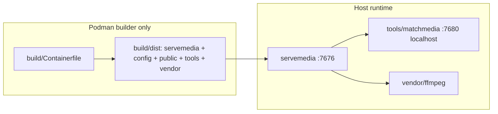

# Architecture

ServeMedia is the Self-hosted Media-Server for Linux, it supports (scan, metadata, playback).  
A Podman **builder** writes `build/dist/`; runtime is the **host binary** (`./build/run`), not a container. Metadata lookup is delegated to first-party [MatchMedia](https://github.com/AlyShmahell/MatchMedia) staged under `{exeDir}/tools/matchmedia/`.  
Third-party assets live under `{exeDir}/vendor/`.

## Layout

| Path | Role |
|------|------|
| `servemedia` | HTTP server (`-config`, `--prepare`) |
| `servemedia/internal` | config, db, scan, fetch, stream, transcode, matchmedia client |
| `servemedia/web` | go:embed templates + first-party static (`app.css` / `app.js` / `controls.js` / logos) |
| `servemedia/share/config` | Seed `default.yaml` copied into `build/dist/config` |
| `servemedia/share/applications` | `servemedia.desktop` staged to `{exeDir}/share/applications` |
| `install.sh` | TTY GitHub-release install into `~/.servemedia` (userscope desktop, icon, `~/.local/bin`) |
| `build/` | Podman dist builder: Containerfile, compose, host `run`, image helper `build` |
| `flatpak/` | TTY `build` menu, `containerfile`, manifest, AppStream, `pins/` Go lists, runtime wrapper `servemedia` for `eu.alyshmahell.ServeMedia` (Freedesktop 25.08) |
| `build/cache/` | Host cache (gitignored): ffmpeg bins + LICENSE reused across rebuilds; `matchmedia-<version>-linux-amd64.tar.gz` (must match `matchmedia.version` and the archive’s inner `version:`) overlays `tools/matchmedia` at stage time; Flatpak SDK/Platform under `cache/flatpak` |
| `{exeDir}/config` | Seed YAML (`-config` default `{exeDir}/config/default.yaml`) |
| `{exeDir}/public` | First-party static copy in the dist tree (templates stay embedded) |
| `{exeDir}/data` | SQLite store, transcode cache, backups, overlay `config.yaml`, MatchMedia `data/matchmedia` (Flatpak: `$XDG_DATA_HOME/servemedia/data`) |
| `{exeDir}/tools/matchmedia` | First-party MatchMedia v0.0.8 (binary, `config/`, `public/`, `LICENSE`) |
| `{exeDir}/vendor` | Third-party only: htmx, video.js, hls.js, ffmpeg (+ licenses) |
| `tests/` | Podman unit (`go test` via `tests/images`) + Playwright smoke against bind-mounted dist; OMDb and webhook stubs share one image |

`tools/` is first-party helper programs. `vendor/` is third-party only.

## Packages

The packager writes a tarball with root `servemedia/` and ServeMedia’s `LICENSE` (`./build/run` → **(re)build & package**). A sideload Flatpak is `./flatpak/build` (compiles the git tags pinned in the manifest):

| Archive | Contents |
|---------|----------|
| `servemedia-<ver>-linux-amd64.tar.gz` | binary, `config/`, `public/`, `tools/matchmedia/`, `{exeDir}/vendor/` (htmx, video.js, hls.js, ffmpeg + licenses) |
| `servemedia-<ver>-linux-amd64.flatpak` | same dist without `vendor/ffmpeg`; runtime `org.freedesktop.Platform.ffmpeg-full` (25.08) |

## HTTP

ServeMedia is the only public listener (`:7676`). After it binds, it opens the app in the browser when `DISPLAY`/`WAYLAND_DISPLAY` is set (`SERVEMEDIA_NO_BROWSER=1` skips). If the port is already in use, a second start opens the app and exits. MatchMedia binds `127.0.0.1:7680` and is not a user-facing admin console.

| Method | Path | Role |
|--------|------|------|
| GET | `/` | home |
| GET | `/healthz` | process liveness |
| GET | `/about` | version + `{exeDir}/LICENSE` |
| GET/POST | `/settings/integrations` | webhooks (per user) and MatchMedia secrets (admin) |
| POST | `/play/{kind}/{id}/session` | direct or HLS playback session |
| GET | `/stream/{kind}/{id}` | byte-range original |
| GET | `/hls/{job}/…` | transcode playlist/segments |
| GET | `/static/vendor/*` | `{exeDir}/vendor` (htmx, video.js, hls.js) |
| GET | `/static/*` | embedded first-party static |

Playback uses **video.js** with **hls.js** attached to the video.js tech for HLS. Session, progress, prefs, VTT, chapters, and prev/next episode stay on ServeMedia APIs. Site directional focus (keyboard and gamepad) is first-party `controls.js`; on the player page, keyboard arrows stay with video.js.

## Libraries and scan

Libraries have a name and folder only — no movie/TV/anime type. **Local** scan uses one mixed disk walker: a directory is a show when it `looksLikeShowDir`, otherwise films. `media_items.kind` is `movie` or `show` from that detection.

**Scan with MatchMedia** does not run ServeMedia’s mixed library walker. Library scan sends `POST /v1/scan` `{"path":"<abs dir>","mode":"rescan"|"changes"}` (jailed by `media.path` roots) and receives `202 {"session","files","mode"}`. Omit `mode` or send `"rescan"` for a full provider search. `"changes"` groups the current tree the same way; titles with complete beside-media NFO+poster become `matched` from the sidecar without a provider search; incomplete titles stay `pending` and rematch. Changes may send optional `require_episode_nfo` (bool, default true; omit to default); rescan must omit it. Completeness stays title NFO+poster; when the flag is true MatchMedia also requires per-episode NFO, not episode thumbs. `files[]` is every current video on that title, not a delta. Per-item rescan sends `POST /v1/ingest` with the title from the scan modal (and year when known) so MatchMedia ranks that query; the existing library row is updated in place. MatchMedia groups library titles and matches; scan jobs set `path` to the grouped child (folder or movie file) and include numbered `files[]` (video files only, longest-prefix ownership so a named sibling keeps its own tree). ServeMedia inventories those video paths, classifies movie vs show with the same `LooksLikeShowDir` rules as local scan, and applies MatchMedia’s season/episode numbers. Immediate kinds/extras folders stay on the parent with season `0`; named siblings stay separate titles. Loose `{path}` entries (season/episode omitted) and ingest jobs with empty `files[]` still use local numbering / a walk of `job.path`. Persist-beside-media NFO/art stays in ServeMedia when checked. Library scan modal: **Local**, **Scan with MatchMedia (Rescan)**, **Scan with MatchMedia (Changes)** (Changes forces overwrite off). Changes skips catalog/nest (and episode re-ingest when `files[]` already matches) when the path already has meta; new or moved paths and incomplete titles still apply. After a successful library scan (local or MatchMedia), ServeMedia reuses a unique moved title onto the existing row when the old path is gone, then drops catalog rows whose files no longer exist. The per-title modal adds **Dissociate current NFO+poster** (deletes store and beside-media NFO/art, reverts the title to the filename, and sets `match_status=skipped` so later library MatchMedia scans ignore the row until the user rematches from this modal). Per-item MatchMedia never auto-applies, including a singular high-score `matched` job: ServeMedia parks at `manual` and opens the candidate picker (seeding `job.Match` when `candidates` is empty). **Don't add** sets `skipped` without writing catalog NFO/art; closing the dialog leaves the orange `!` for later. The per-title modal shows an editable title when MatchMedia is selected.

MatchMedia scan jobs are untyped (`source: "scan"`). Per-item ingest jobs are also sent untyped so every provider can run. `job.path` is the grouped child (folder or movie file) for scans. `match.prefer.anime` is a rank/auto-match hint on typed `anime` jobs and on untyped scans when any candidate matches; every provider hit stays on `job.candidates` with its score. Candidate ranking is token-set Jaccard plus a residual plot/parent score (`ranker: set`); SequenceMatcher is grouping-only. Overlay YAML must not set removed `match.weights`.

## MatchMedia

On start ServeMedia writes `tools/matchmedia/data/config.yaml` (optional `SERVEMEDIA_MATCHMEDIA_OVERLAY` first, then `http.addr`, `data_dir: {exeDir}/data/matchmedia`, `browse_root` covering every `media.path` root — common ancestor, or `/` if disjoint) and spawns `{exeDir}/tools/matchmedia/matchmedia`. If a listener is already healthy, it is restarted so the new overlay loads. `Within("/")` treats every absolute path as inside the filesystem root. Leftover `tools/matchmedia/vendor` from older llama.cpp installs is deleted on start. `--prepare` verifies the MatchMedia binary, fetches third-party `vendor/` if missing, then exits.

Library scan apply: `POST /v1/scan` `{"path":"<abs dir>","mode":"rescan"|"changes"}` (must sit under `browse_root`; non-empty path must be absolute) returns a session id (`<UTC datetime>-<16 hex chars>`). Changes may include optional `require_episode_nfo` (bool, default true; omit to default); rescan omits it. `mode` is echoed on the `202` body. Per-item MatchMedia scan: `POST /v1/ingest` JSON `[{title, year?}]` (no `type`) returns `202 {"session","jobs"}`. Poll `GET /v1/scan/status?session=` (ignored when ingest has no grouping run) then `GET /v1/jobs?session=`. Jobs live in `{data_dir}/jobs-{session}.json` until `session.ttl_ms` (clamped to `session.ttl_max_ms`, shipped 24h). Catalog GET still requires `?session=` and a match in that session. Apply nests related finished jobs (path under a show, or title-similar spin-off / film) as first-class `media_items` with `parent_id` — they keep their own title, poster, plot, match status, and scan/pick UI, and are hidden from the library grid. Title-similar nesting uses all non-stop tokens, including short ones, so franchise siblings like Stargate SG-1 / Atlantis stay separate. Immediate kinds/extras folders stay on the parent as season 0; a leftover second Specials/Movies scan job still merges onto the parent. Inventory is numbered `files[]` video paths when MatchMedia sends them (never a directory as an episode); ingest jobs with empty `files[]` walk `job.path`, and ingest jobs with no path apply onto the existing media row. **`matched`**: library scan applies catalog fields from `GET /v1/catalog/{provider}/{id}?session=` (relative poster URLs are resolved against MatchMedia with the same query) joined by MatchMedia’s season-episode numbers (catalog GET / select still map files onto the catalog), unless `match_status=skipped`. Per-item scans do not auto-apply `matched` jobs. **`manual`**: store the session and job id and still inventory `files[]` (or the tree when `files[]` is empty); ServeMedia shows an orange `!` on the poster and a candidate picker (`POST /v1/jobs/{id}/select?session=`). **`unmatched` / `error`**: inventory only. **`skipped`**: library MatchMedia leaves the row alone; per-item Scan with MatchMedia still opens the picker. Catalog episode stills are downloaded during apply; ffmpeg episode stills are not taken during MatchMedia apply (`-hide_banner -loglevel error`, seek retries). Provider keys come from MatchMedia `GET /v1/secrets` / `POST /v1/secrets` and are never stored in ServeMedia YAML. Rows that have a job id but no session (pre-v0.0.3) need a rescan.

ServeMedia owns SQLite, playback, persist-beside-media, ffmpeg stills, and the candidate picker UI. MatchMedia owns browse jail, directory walk, grouping, numbering, matching, catalog bytes, and path→catalog mapping. Do not `DELETE /v1/jobs?session=` while a manual pick may still be needed.

## Data and ffmpeg

Writable data defaults under `{exeDir}/data`. Overlay `{exeDir}/data/config.yaml` is merged after seed YAML. `SERVEMEDIA_MEDIA_PATH` / `media.path` is the library root (comma-separated paths are jailed separately but shown as one tree in the add-library picker). ffmpeg/ffprobe resolve to `{exeDir}/vendor/ffmpeg/` (`SERVEMEDIA_FFMPEG` override). `./build/run` drives Podman; the image runs `build/build stage`, which wipes `build/dist` first (including `data/`), then copies ffmpeg from `build/cache/ffmpeg` or compiles into that cache (static codecs, dynamic libva/libdrm), and unpacks `build/cache/matchmedia-<version>-linux-amd64.tar.gz` over `tools/matchmedia` when the filename and inner `version:` match `matchmedia.version`. VAAPI probes host `/dev/dri` and needs host Mesa/`libva` (`libva.so.2`, `libdrm.so.2`). Software `libx264` is the fallback.

Idle HLS transcode jobs are cancelled a few minutes after last segment access. The process itself is not stopped when the browser is idle.
