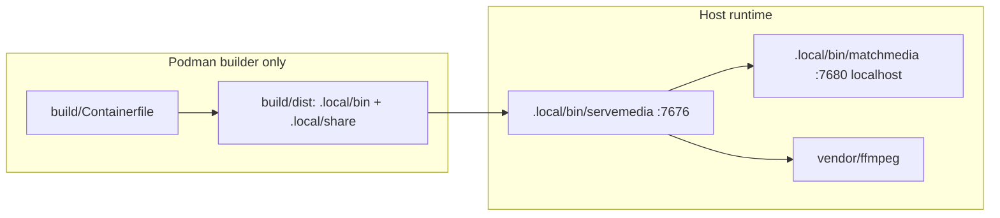

# Architecture

ServeMedia is the self-hosted media server for Linux (scan, metadata, playback). A Podman **builder** writes `build/dist/` as an XDG tree; runtime is the **host binary** (`./build/run`), not a container. Metadata lookup is first-party [MatchMedia](https://github.com/AlyShmahell/MatchMedia) as a sibling XDG app. Third-party assets live under `{payload}/vendor/`. Payload is `SERVEMEDIA_ROOT` or `$XDG_DATA_HOME/servemedia`.

Go module: `github.com/alyshmahell/servemedia/src`.


```mermaid
flowchart LR
  subgraph build [Podman builder only]
    CF[build/Containerfile]
    CF --> Dist["build/dist: .local/bin + .local/share"]
  end
  subgraph host [Host runtime]
    Dist --> ServeMedia[".local/bin/servemedia :7676"]
    ServeMedia --> MatchMedia[".local/bin/matchmedia :7680 localhost"]
    ServeMedia --> FFmpeg["vendor/ffmpeg"]
  end
```

## Layout

| Path | Role |
|------|------|
| `src/cmd` | HTTP server (`-config`, `--prepare`) |
| `src/internal` | config, db, fetch (numbered `files[]` ingest, prune, reattach, dissociate), media (probe/HLS/ffmpeg), matchmedia client |
| `src/web` | go:embed templates + first-party static |
| `src/share/config` | Seed `default.yaml` → `build/dist/.local/share/servemedia/config` |
| `src/share/applications` | `servemedia.desktop` staged to `.local/share/applications` |
| `build/` | Podman dist builder (`Containerfile`, compose, host `run`, `build`) |
| `flatpak/` | TTY `build` online/offline, manifest, AppStream, `pins/`, wrapper (`eu.alyshmahell.ServeMedia`, Freedesktop 26.08) |
| `build/cache/` | ffmpeg bins + LICENSE; `matchmedia-<version>-linux-amd64.tar.gz` (filename and inner `version:` must match `matchmedia.version`); Flatpak SDK/Platform under `cache/flatpak` |
| `{payload}/config` | Seed YAML (`-config` default `{payload}/config/default.yaml`) |
| `{payload}/public` | First-party static in dist (templates stay embedded) |
| `$XDG_DATA_HOME/servemedia` | SQLite store, backups, overlay `config/overlay.yaml` (Flatpak: sandbox XDG) |
| `$XDG_CACHE_HOME/servemedia/transcode` | HLS cache |
| `.local/bin/matchmedia` | MatchMedia v0.1.0 (Flatpak: `/app/tools/matchmedia/matchmedia`) |
| `.local/share/matchmedia` | MatchMedia seed `config/` + `public/` (Flatpak: `/app/tools/matchmedia`) |
| `{payload}/vendor` | Third-party only: htmx, video.js, hls.js, ffmpeg (+ licenses) |
| `tests/` | Podman unit + Playwright smoke against bind-mounted dist |

`vendor/` is third-party only. Host MatchMedia is a sibling XDG app; Flatpak keeps it under `/app/tools/matchmedia`.

## Rules

- Podman with `podman-compose` (or `podman compose`)
- Do not install or run Go, Node, or Playwright on the host for ServeMedia tests
- Never `go test` / `npm test` / `npx playwright` on the host for this repo’s automated path
- Never Docker as the test runner (`./tests/run` refuses Docker-only environments)
- App data: `$XDG_DATA_HOME/servemedia` (or `build/cache/xdg` for `./build/run`); tests use a compose XDG volume

## Dist

[`build/Containerfile`](../build/Containerfile) is a one-shot **builder**. Host driver: [`./build/run`](../build/run). Image helper: [`build/build`](../build/build) (`vendor` at image build, `stage` at container start).

| Item | Value |
|------|--------|
| Go image | `docker.io/library/golang:1.26-bookworm` |
| Build | `CGO_ENABLED=0 GOOS=linux GOARCH=amd64` |
| App version SoT | `version` in `src/share/config/default.yaml` |
| MatchMedia pin | `matchmedia.version` in the same file |
| Dist wipe | `build/dist` wiped at container start (`.gitkeep` kept) |
| `build/cache` | never deleted |

Stage tree:

| Dest | Source |
|------|--------|
| `.local/bin/servemedia` | Go `./cmd` |
| `.local/share/servemedia/config/` | `src/share/config` |
| `.local/share/servemedia/public/` | first-party static |
| `.local/share/applications/` | desktop |
| dist root + share `LICENSE` | repo `LICENSE` |
| `.local/share/servemedia/vendor/` | third-party JS at image build |
| `.local/bin/matchmedia` + `.local/share/matchmedia/{config,public}` | `build/cache/matchmedia-<pin>-linux-amd64.tar.gz` when filename and inner `version:` match; else `matchmedia.url` (basename must be that archive name) |
| `.local/share/servemedia/vendor/ffmpeg` | copy from `build/cache/ffmpeg` or compile into that cache |

ffmpeg: codecs (x264, x265, Opus, dav1d, SVT-AV1, libvpx, LAME, libvpl) static; `libva` / `libdrm` dynamic; NVENC headers only. Delete `build/cache/ffmpeg` to force a recompile after bumping vendor URLs.

`./build/run` menu:

| Choice | What |
|--------|------|
| **run** | copy `build/dist/.local` → `build/cache/xdg`, exec with `HOME` there (fails if `.local/bin/servemedia` missing) |
| **(re)build & run** | rebuild dist, then run |
| **(re)build & prepare** | verify `.local/bin/matchmedia`, fetch vendor if missing, exit |
| **(re)build & package** | tarball + AppImage (not Flatpak) |

## Packages

| Archive | ffmpeg | Notes |
|---------|--------|-------|
| `servemedia-linux-amd64.tar.gz` | vendored `vendor/ffmpeg` (static codecs, host libva) | root `servemedia/` + `LICENSE`; `.local/bin/{servemedia,matchmedia}` + share trees |
| `servemedia-linux-amd64.AppImage` | same ELFs; host `libva` / Mesa | packs that tarball (quick-sharun / sharun / uruntime); `SERVEMEDIA_ROOT` = bundled share; data under `$XDG_DATA_HOME/servemedia`; needs `/dev/dri` for GPU |
| `servemedia-linux-amd64.flatpak` | none; `org.freedesktop.Platform.ffmpeg-full` (26.08) | `./flatpak/build`; app id `eu.alyshmahell.ServeMedia`; wrapper `SERVEMEDIA_ROOT=/app`; data `~/.var/app/eu.alyshmahell.ServeMedia/data/servemedia/` |

Sideload:

```bash
flatpak install --user build/package/servemedia-linux-amd64.flatpak
flatpak run eu.alyshmahell.ServeMedia
```

`./flatpak/build` (needs host `podman` + `flatpak`; runtimes in `build/cache/flatpak`):

| Mode | Source |
|------|--------|
| **online** | latest GitHub ServeMedia release; regen Go pins from tags; `modules.txt` as URL+sha256 |
| **offline** | local `src/share/config/default.yaml` (version SoT); regen from local `src/` (`type: dir`); MatchMedia still cloned by tag; pin `modules.txt` stays `path:` |

Each mode: resync → regen → lint → build → package → install. Manifest: [`flatpak/eu.alyshmahell.ServeMedia.yml`](../flatpak/eu.alyshmahell.ServeMedia.yml). Wrapper: [`flatpak/servemedia-wrapper`](../flatpak/servemedia-wrapper). Pins: [`flatpak/pins/`](../flatpak/pins/). Dist and Flatpak MatchMedia are `v0.1.0` (`matchmedia.version` / git tag); dist prefers `build/cache/matchmedia-0.1.0-linux-amd64.tar.gz`.

Sandbox reads `/media`, `/mnt`, `/run/media`, `~/Videos`, `~/Music`; other paths need `flatpak override --filesystem=…`.

## HTTP

ServeMedia is the only public listener (`:7676`). Opens the browser when `DISPLAY`/`WAYLAND_DISPLAY` is set (`SERVEMEDIA_NO_BROWSER=1` skips). If the port is in use, a second start opens the app and exits. MatchMedia binds `127.0.0.1:7680` (not a user-facing console).

| Method | Path | Role |
|--------|------|------|
| GET | `/` | home |
| GET | `/healthz` | process liveness |
| GET | `/about` | version + `{payload}/LICENSE` |
| GET/POST | `/settings/integrations` | webhooks (per user) and MatchMedia secrets (admin) |
| POST | `/play/{kind}/{id}/session` | direct or HLS playback session |
| GET | `/stream/{kind}/{id}` | byte-range original |
| GET | `/hls/{job}/…` | transcode playlist/segments |
| GET | `/static/vendor/*` | `{payload}/vendor` (htmx, video.js, hls.js) |
| GET | `/static/*` | embedded first-party static |

Playback: **video.js** + **hls.js** on the video.js tech. Session, progress, prefs, VTT, chapters, prev/next stay on ServeMedia APIs. Site focus is first-party `controls.js`; on the player page, keyboard arrows stay with video.js.

Idle HLS jobs are cancelled a few minutes after last segment access. The process is not stopped when the browser is idle.

## Data

| Item | Where |
|------|--------|
| Writable data | `$XDG_DATA_HOME/servemedia` (`SERVEMEDIA_HOME` override) |
| Overlay | `config/overlay.yaml` merged after seed |
| Transcode cache | `$XDG_CACHE_HOME/servemedia/transcode` |
| Media root | `SERVEMEDIA_MEDIA_PATH` / overlay `media.path` (comma-separated paths jailed separately, one picker tree; `$HOME`, `$XDG_VIDEOS_DIR`, `$XDG_MUSIC_DIR` expand) |
| ffmpeg/ffprobe | `{payload}/vendor/ffmpeg/` (`SERVEMEDIA_FFMPEG` override); Flatpak: `ffmpeg` on `PATH` when that tree is absent |

## Libraries and scan

Libraries have a name and folder only (no movie/TV/anime type). Local, Rescan, and Changes all go through MatchMedia grouping. ServeMedia does not re-walk the tree to classify extras or kinds. Structural filename parsers (SxxEyy, year, `1x02`) stay for display and persist naming. Extras/kinds live in MatchMedia overlay (`group.extras` / `group.kinds`). ServeMedia overlay has no `scan.layout`. Fetch remaining work: numbered `files[]` ingest, prune, reattach, dissociate.

| Mode | MatchMedia | Dialog default | `require_episode_nfo` | Overwrite |
|------|------------|----------------|----------------------|-----------|
| Local (`nfo`) | `POST /v1/scan` `mode=nfo` | — | omit (MM default false) | — |
| Rescan | `mode=rescan` | — | omit | — |
| Changes | `mode=changes` | when MM is ready | omit (MM default true) | forced off |

When MatchMedia is down, all three options are disabled (no walker fallback). Entry scan keeps Dissociate. Persist-beside-media NFO/art stays in ServeMedia when checked. User title, plot, and poster edits always write store plus beside-media NFO/art (not gated on the scan persist checkbox). Stills and nested-movie sidecars never overwrite an existing show `poster.jpg`. Poster/still file changes persist only when Save is clicked in the poster dialog.

| Apply input | Rule |
|-------------|------|
| `job.kind` | `movie` / `show` |
| extras | `role=extras` only → season 0 on parent (`catalog_for` is not extras) |
| `kind=movie` under a show | child movie card beside seasons (matched or unmatched); not season 0 |
| Specials | `role=extras`, or `files[]` with `season: "0"` / unnumbered files **on the show job** |
| `files[]` | every current video on that title (not a delta); empty or unnumbered skips episode ingest |
| `job.path` | grouped child (folder or movie file) |
| per-item | `POST /v1/ingest` `[{title, year?}]` untyped; never auto-applies (`matched` parks at `manual` + picker) |
| Changes skip | catalog/nest (and episode re-ingest when `files[]` already matches) if path already has meta |
| after library scan | reuse a unique moved title onto the existing row when the old path is gone; drop catalog rows whose files no longer exist |
| Dissociate | delete store + beside NFO/art; revert title to filename; `match_status=skipped` |
| **Don't add** | `skipped` without catalog NFO/art; closing the dialog leaves the orange `!` |

`match.prefer.anime` is a rank/auto-match hint on typed `anime` jobs and on untyped scans when any candidate matches. Ranking is token-set Jaccard plus residual plot/parent (`ranker: set`). SequenceMatcher is grouping-only. Overlay YAML must not set removed `match.weights`. Title-similar nesting is a **strict** token prefix (spin-off titles longer than the parent). Identical titles and the same `catalog_for` / `meta_id` are not spin-offs. Short tokens stay so Stargate SG-1 / Atlantis stay separate.

## MatchMedia

On start ServeMedia:

1. Seeds `$XDG_DATA_HOME/matchmedia/{config/default.yaml,public}` from bundled share (Flatpak: `/app/tools/matchmedia`) when missing
2. Writes `$XDG_DATA_HOME/matchmedia/config/overlay.yaml` from MatchMedia `default.yaml` merged with any existing overlay and optional `SERVEMEDIA_MATCHMEDIA_OVERLAY` (UI-saved keys win except `group.kinds`, which the seed always restores so upgrades drop removed tokens such as `movie` / `movies` / `film`; new seed keys still appear; `data_dir` / `browse_root` dropped; ServeMedia does not write `http.addr` or `browse_roots`)
3. Exec `.local/bin/matchmedia -config <seed>` (Flatpak: `/app/tools/matchmedia/matchmedia`)
4. Connects at `matchmedia.addr` (`127.0.0.1:7680`); if a listener is already healthy, it is restarted so the new overlay loads

`--prepare` verifies the MatchMedia binary, fetches third-party `vendor/` if missing, then exits. Admin Settings → Engines: secrets (`GET`/`POST /v1/secrets`), overlay YAML (`GET`/`POST /v1/config`), Restore default (delete overlay then POST the seed), Restart (`Stop` then `Start`). ffmpeg probe copy is on the same page’s ffmpeg tab.

| Call | Body / query | Result |
|------|----------------|--------|
| `POST /v1/scan` | `{"path":"<abs dir>","mode":"nfo"|"rescan"|"changes"}` under `browse_roots` | `202` session id (`<UTC datetime>-<16 hex chars>`); `mode` echoed; Changes may send `require_episode_nfo` |
| `POST /v1/ingest` | JSON `[{title, year?}]` (no `type`) | `202 {"session","jobs"}` |
| `GET /v1/scan/status?session=` | ignored when ingest has no grouping run | then `GET /v1/jobs?session=` |
| `GET /v1/catalog/{provider}/{id}?session=` | required | relative posters resolved against MatchMedia |
| `POST /v1/jobs/{id}/select?session=` | candidate pick | — |

Jobs live in `{data_dir}/jobs-{session}.json` until `session.ttl_ms` (clamped to `session.ttl_max_ms`, shipped 24h). Do not `DELETE /v1/jobs?session=` while a manual pick may still be needed. Rows with a job id but no session (pre-v0.0.3) need a rescan.

| `match_status` | Library scan | Per-item |
|----------------|--------------|----------|
| `matched` | apply catalog fields + season-episode numbers unless `skipped` | park at `manual`, open picker (seed `job.Match` when `candidates` is empty) |
| `manual` | store session + job id; inventory numbered `files[]`; orange `!` + picker | same |
| `unmatched` / `error` | inventory only | inventory only |
| `skipped` | leave the row alone | Scan with MatchMedia still opens the picker |

Apply nests related finished jobs (path under a show, or a **strict** title-prefix spin-off) as first-class `media_items` with `parent_id` — own title, poster, plot, match status, scan/pick UI; hidden from the library grid. Identical titles or the same catalog id are not nested. Catalog episode stills download during apply. After apply (and one unmatched-show retry on library scans), a final **Extracting stills…** pass uses ffprobe+ffmpeg (`-hide_banner -loglevel error`, seek retries) for movies/episodes that still have no art. Nested `kind=show` jobs apply on the child, never on the ancestor. Provider keys come from MatchMedia secrets and are never stored in ServeMedia YAML.

| Owns | |
|------|--|
| ServeMedia | SQLite, playback, persist-beside-media, ffmpeg stills, candidate picker UI |
| MatchMedia | browse jail, directory walk, grouping, numbering, matching, catalog bytes, path→catalog mapping |

## Tests

```bash
./tests/run
```

| Menu | |
|------|--|
| 1 | unit (`go test` in `tests/images/unit.Containerfile`) |
| 2 | smoke (Playwright against compose `servemedia` on the dist tree) |
| 3 | all |

No TTY (CI): unit then smoke. `./tests/run` builds `build/dist/` before smoke. Image recipes: `tests/images/`. OMDb and webhook stubs share `tests/images/stub.Containerfile`. Smoke bind-mounts `tests/fixtures/media` **read-only**. Overlay [`tests/matchmedia-overlay.yaml`](../tests/matchmedia-overlay.yaml) sets `browse_roots: [/media]` and points providers at `omdb-stub`; Film Title still hits the OMDb search fixture. Does not use MatchMedia’s check / live / stub-chat harness.

Manual: `./build/run` → **(re)build & run** (or **run** if dist exists) → register admin → set `SERVEMEDIA_MEDIA_PATH` if needed.

Idle `servemedia` is ~0% CPU. MatchMedia is a second process on `127.0.0.1:7680`. Ctrl+C on `./build/run` stops the host binary.

```bash
pgrep -a servemedia
ps -o pid,pcpu,rss,comm -p "$(pgrep -n -f '/servemedia$')"
```

## VAAPI

GPU encode uses **host** Mesa/libva and `/dev/dri`. Dist ffmpeg: static codecs, dynamic libva/libdrm. AppImage does not ship `libva.so.2`. Fully static builds cannot drive host VAAPI. Software `libx264` is the probe fallback. A host without `libva.so.2` cannot start the bundled `ffmpeg`.

| Distro | Packages |
|--------|----------|
| Fedora | `libva libdrm mesa-dri-drivers mesa-va-drivers`; H.264/HEVC VA also needs RPM Fusion `mesa-va-drivers-freeworld` |
| Debian | `libva2 libdrm2 mesa-va-drivers` |

`hwaccel: none` in overlay skips the probe / forces software.

| Pipeline | When |
|----------|------|
| `vaapi_full_av1_10` | 10-bit + AV1 GPU — decode on GPU, encode `av1_vaapi` as P010 (no 8-bit convert) |
| `vaapi_full` | First 8-bit attempt — input `-hwaccel vaapi` + `scale_vaapi=format=nv12` |
| `vaapi_full_10bit` | 10-bit fallback — GPU decode, CPU 10→8 via hwdownload, GPU encode |
| `vaapi_hybrid` | CPU decode + GPU encode |
| `software` | Last resort — `libx264` |

Settings → Engines (ffmpeg tab) shows probe status and the active pipeline when transcoding.
